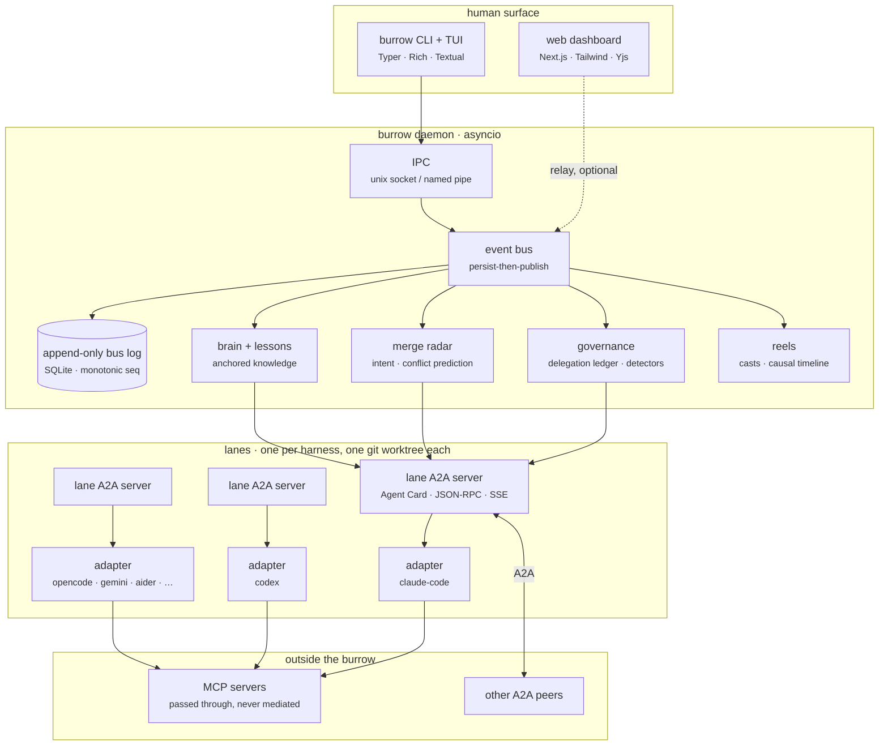

<div align="center">

# OpenBurrow

**Terminal-native, protocol-grounded multi harness agent collaboration.**

Run several coding agents side by side in isolated git worktrees, and make them
talk to each other over the protocols they were already going to speak — with a
governance layer that can answer *who authorised this, and what were they allowed
to do*.

[](https://www.python.org/)
[](https://docs.astral.sh/uv/)
[](#protocol-grounding)
[](LICENSE)

</div>

---

## The short version

Most multi-agent tools are a supervisor process that pipes text between agents. It
works, until you need to know why an agent did something.

OpenBurrow takes a different position: **don't invent a bus format.** Agents are
already being given standard protocols to talk to each other and to their tools.
Use those, and spend the engineering effort on the part nobody has solved — the
accountability layer.

So:

- The bus speaks **A2A** ([Agent2Agent](https://a2aproject.github.io/A2A/), Linux
  Foundation). Every lane publishes an Agent Card, serves JSON-RPC, streams over
  SSE, and runs the standard eight-state task lifecycle. A lane in OpenBurrow looks
  like an ordinary A2A peer to anything else on the network.
- Tool access goes through **MCP**, passed through untouched. OpenBurrow does not
  mediate your tools, and does not want to.
- Negotiation uses **ACP** performatives — `propose` / `counter` / `accept` /
  `reject` / `inform` — so a disagreement has a shape a machine can reason about,
  instead of being two agents being polite at each other.
- And **Stage 14** adds the layer all three protocols explicitly leave
  unspecified: delegation authority, accountability across trust boundaries, and
  audit obligations. That is the point of the project.

## The gap this fills

A2A, MCP, and ACP each document what they do *not* do, and they overlap on one
omission. None of them can express:

| Question | A2A | MCP | ACP |
|---|---|---|---|
| Who is allowed to delegate what? | ✗ | ✗ | ✗ |
| What authority actually transferred? | ✗ | ✗ | ✗ |
| Who is accountable when an agent acts on another's behalf? | ✗ | ✗ | ✗ |
| What must be audited when a call crosses a trust boundary? | ✗ | ✗ | ✗ |

These are not implementation details. They are the questions that decide whether
an autonomous system is deployable in an organisation that has auditors. A2A will
happily carry a task delegation from Agent A to Agent B; it has no opinion on
whether A was entitled to delegate it.

OpenBurrow's governance layer does. Its central invariant is one sentence:

> **Authority originates with a human and can only ever narrow.**

Enforced in code, not in a policy document. A delegation cannot be constructed
without naming the human who authorised it. A sub-delegation is intersected with
what the delegator actually held, so it cannot widen itself. A denial always beats
a wildcard grant, so a broad scope can never be used to smuggle through a
prohibition. Every one of those rules has a test that fails if it stops holding.

## Architecture



Two things about that picture are worth pointing at.

**Each lane is a real A2A server, not a client of a central one.** That is why the
arrows between lanes are absent — lanes talk to each other directly, peer to peer,
the way A2A intends. The bus is a *log*, not a message broker that everything has
to route through.

**The bus log is the only source of truth.** Persist first, publish second. Every
other component — the TUI, the audit report, the radar, a replay, the metrics —
reads from the same append-only log. That is what makes a replay unable to
disagree with what actually happened.

## Quick start

Requires **Python 3.12+**, **git**, and [**uv**](https://docs.astral.sh/uv/).

```bash
# install
uv tool install openburrow          # or: uvx openburrow

# in any repository you want agents to work in
cd ~/code/my-project
burrow init                         # writes openburrow.yaml, seeds AGENTS.md
burrow doctor                       # tells you which harnesses are actually installed

burrow session start --template pair
burrow watch
```

`burrow doctor` is the honest one. It reports which of the ten supported harnesses
are present on your `PATH` and refuses to write lane templates for ones that are
not, so `openburrow.yaml` never claims a capability the machine does not have.

### What it looks like

```
$ burrow session start --name auth-refactor --template pair
  session  auth-refactor  (sess_01M2J8VPB5WKGM10QRRSVPZK1Q)  running
  lanes    alice  claude-code  implementer  → 127.0.0.1:50914
           bob    codex        reviewer     → 127.0.0.1:50917

$ burrow watch
  lanes
    alice  claude-code  implementer  running   12 msgs   implement token rotation
    bob    codex        reviewer     thinking   9 msgs   review src/api/routes.py

  bus
    4182  claim.created       lane_01M2J8…  alice claimed src/api/routes.py
    4190  task.submitted      lane_01M2J8…  review requested for routes.py
    4191  negotiation.start   lane_01M2J8…  alice ↔ bob: signature change
    4195  negotiation.move    lane_01M2J8…  bob counter: keep the old signature
    4201  governance.blocked  lane_01M2J8…  redelegation denied: scope would widen
    4204  task.completed      lane_01M2J8…  review approved with 2 comments

$ burrow report --session auth-refactor
  duration            18m 42s
  lanes               2   messages 21
  collaboration       negotiation precision 0.83   message effectiveness 0.71
  governance          1 delegation, 1 blocked action, 0 unresolved flags
  cost                $1.84
```

That `governance.blocked` line is the interesting one. A sub-delegation was
attempted that would have widened scope beyond what the delegator held. It was
refused, and the refusal is in the audit log with the chain that produced it:

```
$ burrow audit --delegation del_01M2J8…
  del_01M2J8…  alice → bob
    authorised by    maya (human)
    requested        fs:write:src/api/**, fs:read:src/**
    held             fs:write:src/api/routes.py, fs:read:src/**
    ungranted        fs:write:src/api/**          ← refused
    result           delegation.denied
```

## Protocol grounding

### A2A — the bus

Every lane runs a `LaneA2AServer` exposing the four endpoints an A2A peer expects:

| Endpoint | Method | Purpose |
|---|---|---|
| `/.well-known/agent-card.json` | GET | Agent Card, with `openburrow:*` metadata extensions |
| `/` | POST | JSON-RPC 2.0 — `message/send`, `tasks/get`, `tasks/cancel`, … |
| `/stream` | GET | SSE task updates |
| `/health` | GET | liveness |

The task lifecycle is the full eight states: `submitted` → `working` →
`input_required` | `auth_required` → `completed` | `failed` | `canceled` |
`rejected`. Transitions are validated against an explicit graph, and an illegal
transition raises rather than being coerced. `rejected` is deliberately distinct
from `canceled`: one means the assignee refused the work, the other means somebody
withdrew it. Conflating them loses the only signal that a lane is being asked to
do things it considers out of scope.

Two details that matter more than they look:

- **Authority travels in the card.** `openburrow:authorityScope` is an Agent Card
  extension. A `delegate_task` that omits it means *no authority*, not unlimited
  authority. Failing closed on a missing field is the difference between a
  governance layer and a suggestion.
- **Retries are narrow.** The peer client retries transport failures and 5xx, and
  never 4xx. A rejected delegation must not be retried into a loop — a governance
  refusal that gets retried until it succeeds is not a refusal.

### MCP — tool access, untouched

MCP servers are configured by the lane's harness, and OpenBurrow does not sit in
the middle. "MCP is USB-C for tools; A2A is HTTP for agents" is the whole reason
both exist, and a platform that proxies one through the other has added a failure
mode to get a feature nobody asked for.

### ACP — negotiation

When two lanes want the same file, or disagree about an interface, the coordinator
opens an ACP exchange. The performative set is FIPA-ACL derived and deliberately
small: `propose`, `counter`, `accept`, `reject`, `inform`, `withdraw`.

A legality graph makes illegal sequences unrepresentable — you cannot `accept` a
`reject`. When the driver encounters an illegal move it **escalates instead of
coercing it**. Quietly repairing a malformed negotiation would hide the bug that
produced it, and the bug is usually in the harness adapter, which is exactly the
code you want to find out about.

## Governance: closing the documented gap

Four ideas, each enforced in code.

**1. Authority originates with a human and can only narrow.**

```python
# This raises: a delegation with no human behind it is not a delegation.
Delegation(delegator_lane="alice", delegatee_lane="bob", authority_scope=...)

# This is the only sanctioned way to hand off authority. It intersects with what
# the delegator actually held, so a sub-delegation cannot widen itself.
child_scope = held.narrow(requested)  # → only what both allow
```

**2. Denial beats grant.** `AuthorityScope.allows()` checks denials first. A broad
wildcard grant can never be used to smuggle through a specific prohibition,
because the prohibition is consulted before the grant is.

**3. Detection is separated from enforcement.** They have opposite failure modes:

| | false positive costs | so it must |
|---|---|---|
| **Enforcement** | a stalled session, a blocked human | never fire on a legitimate action |
| **Detection** | one dismissible flag | be noisy — silence is the real failure |

Collapsing them into one component means tuning it for one failure mode and
getting the other. So `DelegationLedger` enforces and refuses to guess;
`detectors.py` detects and refuses to block. A flagged-but-allowed action is a
correct outcome, not a bug.

**4. Defense in depth on the prompt path.** A lesson is a prompt fragment injected
into every lane's context, which makes the lesson path the highest-value injection
target in the system. So `detect_poisoned_lesson` runs *independently* of the
Brain's own classifier. One compromised component does not defeat both checks.

## Repository layout

```
openburrow/
├── packages/                    # uv workspace — 11 packages
│   ├── openburrow-core/         # domain models, config, SQLite, the bus log
│   ├── openburrow-a2a/          # Agent Cards, task lifecycle, JSON-RPC/SSE, peer client
│   ├── openburrow-acp/          # performatives and the negotiation driver
│   ├── openburrow-adapters/     # the ten harness adapters + the adapter protocol
│   ├── openburrow-governance/   # delegation ledger, detectors, audit
│   ├── openburrow-brain/        # anchored knowledge, lessons, AGENTS.md, CRDT
│   ├── openburrow-radar/        # intent extraction, conflict prediction
│   ├── openburrow-reel/         # casts, causal timeline, export, share links
│   ├── openburrow-daemon/       # asyncio daemon: IPC, bus, filewatch, sessions
│   ├── openburrow-cli/          # burrow CLI and Textual TUI
│   └── openburrow-relay/        # FastAPI + WebSocket + Postgres relay
├── apps/web/                    # Next.js App Router frontend
├── docs/                        # architecture, protocols, governance, roadmap, guides
├── scripts/                     # smoke_test.py, probe_lane_server.py
├── examples/                    # runnable example repositories
├── docker/                      # relay and CI images
└── fixtures/                    # test fixtures
```

## The stack, and why

| Choice | Why this and not the alternative |
|---|---|
| **uv** | Workspace monorepo with 11 members, one lockfile, reproducible. Also gives `uvx` for the zero-install story. |
| **Typer + Rich + Textual** | Typer for the command surface, Rich for output, Textual for the dashboard. The TUI is optional — `burrow watch` renders the same data as plain ANSI so it works over any terminal and in CI logs. |
| **asyncio daemon** | The workload is waiting on subprocesses, sockets, and file watchers. Threads would be a poor fit and would make the PTY handling much harder. |
| **SQLModel** | SQLAlchemy's engine plus Pydantic's validation, in one declaration. The domain models are the same objects that get persisted and serialised to the wire. |
| **SQLite (WAL) locally** | Zero-config, single file, and WAL means readers never block the writer. Postgres is a first-class option via the same SQLModel layer, and is required for the relay. |
| **`a2a-sdk`** | The reference implementation of the protocol we claim to speak. Hand-rolling it would make "A2A-conformant" a claim about our own code. |
| **LiteLLM** | The conflict judge and lesson classifier must not be coupled to one provider. LiteLLM is the thinnest way to get that. |
| **Yjs + `pycrdt`** | A CRDT the browser already speaks, so the document crosses the wire with no translation layer and therefore no translation bugs. |
| **Next.js App Router** | The replay viewer is a static export that works from `file://`. The dashboard needs a server component, and App Router is where Next.js is going. |

### One honest tradeoff

A Rust implementation would ship as a single static binary. Python does not, and
pretending otherwise would be the kind of thing that shows up in an issue titled
"why does this need a toolchain".

The mitigation is `uv tool install openburrow` and `uvx openburrow`, which is a
one-command install for anyone with `uv` — and `uv` is now common enough that this
covers the overwhelming majority of developers. For air-gapped and offline
deployments, PyInstaller and Nuitka builds are on the roadmap as a documented
fallback. This is a real cost, accepted deliberately, because the reference SDKs
for both A2A and MCP are Python-first and re-implementing them would mean owning
protocol conformance forever.

## Documentation

| Document | What it covers |
|---|---|
| [docs/architecture/overview.md](docs/architecture/overview.md) | How the components fit, and the invariants between them |
| [docs/architecture/adr/](docs/architecture/adr/) | Why each significant decision was made, and what it cost |
| [docs/protocols/a2a.md](docs/protocols/a2a.md) | The A2A binding: cards, lifecycle, extensions |
| [docs/protocols/mcp.md](docs/protocols/mcp.md) | What passthrough means, and what it rules out |
| [docs/protocols/acp.md](docs/protocols/acp.md) | Performatives, the legality graph, escalation |
| [docs/governance/model.md](docs/governance/model.md) | The delegation model and its four invariants |
| [docs/roadmap/README.md](docs/roadmap/README.md) | 22 stages, 258 items, in build order |
| [docs/cli/README.md](docs/cli/README.md) | Every command, with exit codes |
| [docs/adapters/authoring.md](docs/adapters/authoring.md) | Writing an adapter for a harness we do not support |
| [docs/web/README.md](docs/web/README.md) | The replay viewer and the relay dashboard |
| [docs/deployment/README.md](docs/deployment/README.md) | Local, team, and air-gapped deployments |
| [CONTRIBUTING.md](CONTRIBUTING.md) | Development setup and the rules that are not negotiable |
| [SECURITY.md](SECURITY.md) | Threat model and how to report a vulnerability |

## Development

```bash
git clone https://github.com/<you>/openburrow && cd openburrow
uv sync                              # creates .venv, installs all 11 packages

uv run python scripts/smoke_test.py  # end-to-end: real HTTP, real negotiation
uv run pytest                        # unit + integration
uv run ruff check . && uv run mypy packages
```

`scripts/smoke_test.py` is the check to run after touching the protocol,
lifecycle, or governance packages. It stands up two real A2A servers on ephemeral
ports, fetches an Agent Card over HTTP, delivers a real JSON-RPC message, runs a
full ACP negotiation to agreement, and asserts the governance invariants. It exits
non-zero on any failure, which makes it usable as a pre-commit gate.

`scripts/probe_lane_server.py` is the debugging tool. When a lane's A2A server
answers 404 to a route that clearly exists, this prints the route table, the
status and body of every endpoint, and — most usefully — the ASGI scope uvicorn
actually delivered. That last part is how a keep-alive parser bug gets told apart
from a routing bug in under a minute.

## Status

Actively developed. What works today, verified by `scripts/smoke_test.py`:

- A2A lane servers with conformant Agent Cards, full eight-state lifecycle, SSE
- Peer-to-peer JSON-RPC between lanes over real HTTP
- ACP negotiation to agreement, with the legality graph and escalation paths
- Delegation ledger with all four governance invariants enforced
- Adapters for ten harnesses behind one protocol
- Daemon with IPC, event bus, file watching, and crash supervision
- CLI with ~60 commands across 8 verb families
- Brain with git-anchored staleness and corroboration rules
- Merge Radar with certainty separated from prediction
- Session reels with causal timelines and redact-then-sign sharing

Next: the Next.js frontend, the relay, and the test suites.

## License

[Apache-2.0](LICENSE).
